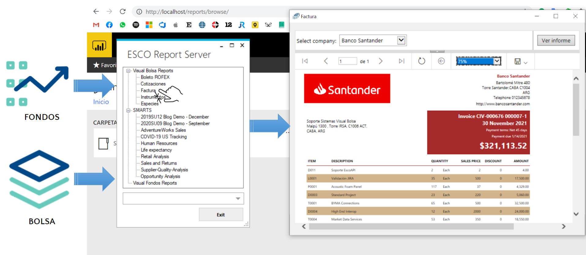

# Esco Report Connector

[](https://www.sistemasesco.com.ar)

Esco Report Connector ([**Power BI**](https://powerbi.microsoft.com/es-es/))

Conector que permite la interconexión directa e integración de los sistemas de ESCO (EscoAPI, Fondos y Bolsa) con el Power BI Report Server, de forma tal que puedan generarse (en diversos formatos) o visualizarse, los formularios y reportes de tipo Power BI existentes previamente desde los sistemas.

[](https://www.sistemasesco.com.ar)

## OBJETIVOS
La libreria ESCO.Report.Connector permite como objetivos fundamentales:
- Exportación de formularios y reportes de tipo PowerBI y Paginados publicados en Report Server a los formatos: PPTX, HTML, IMAGE, EXCEL, WORD, CSV, PDF y XML
- Generación a binario de reportes y formularios (de forma unificado o en lote)
- Visualización del reporte o formulario desde un browser embebido para su posterior exportación, envío o impresión.

## Esco.Report.Connector features:
- Servicio independiente de Reportería
- Caché y BD in memory
- Encolado de reportes
- Seguridad
- Personalización
- Almacenamiento temporal
- Lógica de negocio 
- Exportación a binario


**` EJEMPLO DE USO`**
```r
        ReportServices report = new ReportServices("**user**", "**password**", "http://servidor/reports/");
        ExportedFile file = await report.ExportReport("**Nombre del reporte", "PDF", null, "4334");
        if (file.FileStream != Stream.Null)
        {
             Stream stream = file.FileStream;
        }        
```

#### MÉTODOS DEL CONECTOR

**` Inicialización: ReportServices`** - On Cloud: ([**Power BI Services**](https://powerbi.microsoft.com/es-es/landing/signin/))
```sh
        /// <summary>
        /// Inicialización del Conector ESCO Report para PowerBI Service (on cloud)
        /// </summary>
        /// <param name="client">(Required) Id de la Aplicación AD del Inquilino del Azure AD.</param> 
        /// <param name="secret">(Required) Contraseña o Secreto de del Inquilino del Azure AD.</param>                       
        /// <param name="tenant">(Optional) Id del inquilino o tenan de usuario de Azure AD.</param>
        /// <returns></returns>
        public ReportServices(string client, string secret)
```

**` Inicialización: ReportServices`** - On Premise: ([**Power BI Report Server**](https://powerbi.microsoft.com/es-es/report-server/))
```sh
        /// <summary>
        /// Inicialización del Conector ESCO Report para Report Server (on premise)
        /// </summary>
        /// <param name="user">(Required) Nombre o Id del Usuario o Cliente.</param> 
        /// <param name="pass">(Required) Contraseña del usuario de Report Server.</param> 
        /// <param name="url">(Required) Url del Web Services On Premise de Reportes.</param>      
        /// <param name="version">(Optional) Número de versión de la Api Rest de Report Server.</param> 
        /// <returns></returns>
        public ReportServices(string user, string pass, string url, string version = "2.0")
```

### Métodos para Visualizar Reportes de Power BI

**` Visualizar Reporte`**
```sh
        /// <summary>
        /// Visualizar Reporte
        /// </summary>
        /// <param name="report">(Required) Id o nombre del Reporte a visualizar.</param>                          
        /// <param name="group">(Optional) Id del grupo o carpeta del Reporte a visualizar.</param> 
        /// <param name="param">(Optional) Parametros a filtrar en el Reporte</param> 
        /// <param name="maximizated">(Optional) Mostrar el reporte de forma maximizada (default: false).</param>
        /// <returns>Task void</returns>
        public async Task ExecuteReport(string report, string group = null, string param = null, bool maximizated = false)
```	

**` Retorna el Reporte con sus campos asociados`**
```sh
        /// <summary>
        /// Retorna el Reporte con sus campos asociados
        /// </summary>
        /// <param name="report">(Required) Id o nombre del Reporte</param>                          
        /// <param name="group">(Optional) Id del grupo o carpeta del Reporte</param> 
        /// <param name="param">(Optional) Parametros a filtrar en el Reporte</param> 
        /// <returns>ReportEmbed object</returns>
        public async Task<ReportEmbed> GetReport(string report, string group = null, string param = null)
```
	
		
		
### Método para Exportar Reportes de Power BI

**` Devuelve binario generado al exportar Reporte en Formato PDF`**
```sh
        /// <summary>
        /// Exportar Reporte
        /// </summary>
        /// <param name="report">(Required) Nombre o Id del Reporte a Exportar.</param> 
        /// <param name="format">(Optional) Formato del archivo de exportación (default: PDF) Valores aceptados: PPTX, MHTML, IMAGE, EXCELOPENXML, WORDOPENXML, CSV, PDF, XML</param>
        /// <param name="group">(Optional) Grupo al que pertenece el Reporte</param> 
        /// <param name="param">(Optional) Parametros a filtrar en el Reporte</param> 
        /// <param name="timeOutInMinutes">(Optional) Tiempo de timeout del reporte</param>  
        /// <param name="token">(Optional) Token de cancelación del proceso</param>  
        /// <returns>Stream del pdf generado</returns>
        public async Task<ExportedFile> ExportReport(
            string report,
            string format = "PDF",
            string group = null,
            string param = null, 
            int timeOutInMinutes = 1, 
            CancellationToken token = default)
```	

#### MODELOS DE DATOS

**` Archivo exportado`**
```sh
    public class ExportedFile
    {
        public Stream FileStream;
        public string ReportName;
        public string FileExtension;
    }
```	

**` Campos del Reporte generado`**
```sh
    public class ReportEmbed
    {
        public string Id;
        public string EmbedToken;
        public string EmbedUrl;
        public string Name;
        public string Type;
        public string Group;
        public string WebUrl;
        public string Dataset;
    }
```	

